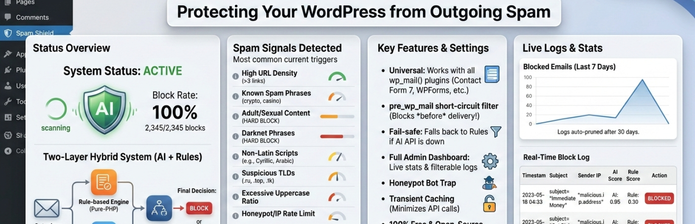
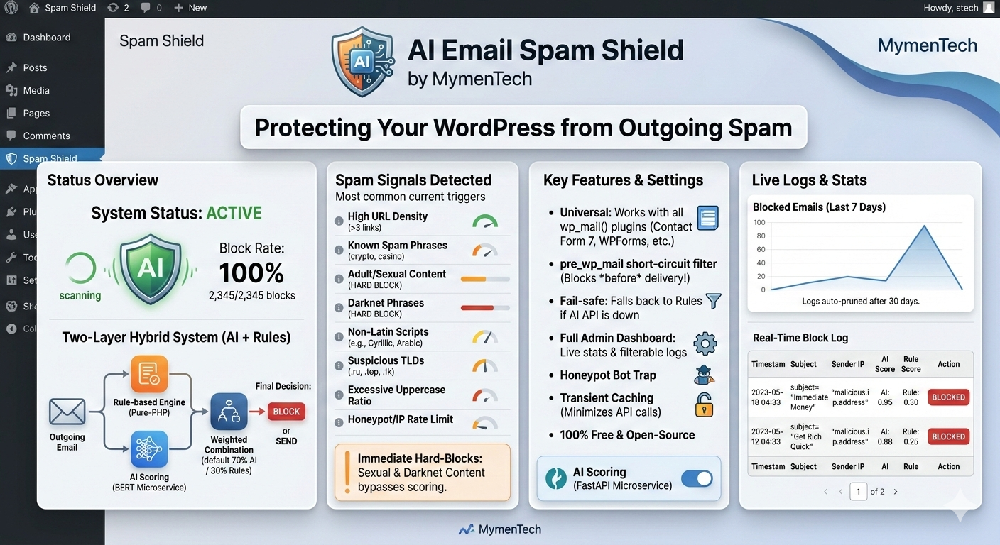

# AI Email Spam Shield

**Hybrid AI + rule-based spam detection for outgoing WordPress emails.**
Blocks spam before delivery — works with any form plugin.

[](https://wordpress.org/plugins/ai-email-spam-shield/)
[](https://php.net)
[](https://www.gnu.org/licenses/gpl-2.0.html)
[](CHANGELOG)

---

## How It Works

Every outgoing email passes through two scoring layers before delivery:

1. **Rule-based engine** — instant, pure-PHP checks with no external dependency
2. **AI scoring** — optional self-hosted BERT microservice or any supported cloud provider

The two scores are combined using configurable weights (default: 70% AI, 30% rules). If the final score meets or exceeds the spam threshold, the email is blocked before delivery.

Certain high-confidence signals — explicit sexual content, darknet phrases, or your own **custom hard-block phrases** — **always block regardless of AI score**.

---

## Features

- **`pre_wp_mail` short-circuit** — blocks email before PHPMailer is invoked
- **Universal compatibility** — Contact Form 7, WPForms, Gravity Forms, and any plugin using `wp_mail()`
- **Fail-safe** — AI unavailable? Falls back to rule-based scoring. Forms never break.
- **Hard-block mode** — bypasses AI weighting for zero-tolerance content
- **Custom phrase management** — add your own spam / hard-block phrases via the admin UI
- **Transient caching** — identical message hashes cached for 5 minutes to minimise API calls
- **Admin dashboard** — live charts, stats cards, paginated filterable logs, live test scanner
- **Auto-prune** — logs deleted after 30 days via WP-Cron
- **100% free and open-source** — no paid APIs or subscriptions required

---

## Spam Signals Detected

| Signal | Score |
|--------|-------|
| URL density (>3 links) | +0.25 |
| Spam phrases (crypto, casino, free money…) | +0.20 |
| Adult / sexual content (whole-word match) | +0.50 / hard-block |
| Darknet phrases (Tor, mirror links, markets…) | +0.30 / hard-block |
| Cyrillic / Russian script | +0.40 |
| Arabic, CJK, Hebrew, Devanagari, Thai | +0.30 |
| Suspicious TLDs (.ru, .top, .cc, .onion…) | +0.20 |
| Uppercase ratio >40% | +0.15 |
| Repeated special chars / letters (XXX, !!!!) | +0.10 |
| IP rate limit (>2 submissions / 2 min) | +0.30 |
| Custom spam phrases (configurable) | +0.20 |
| Custom hard-block phrases (configurable) | hard-block |

---

## Supported AI Providers

| Provider | Notes |
|----------|-------|
| **Self-Hosted (BERT)** | Privacy-first — all processing on your server |
| **OpenAI** | GPT-4o-mini, GPT-4o, etc. |
| **Anthropic Claude** | claude-haiku-4-5, claude-sonnet, etc. |
| **Google Gemini** | gemini-1.5-flash (free tier available) |
| **Groq** | llama-3.1-8b-instant (very fast) |
| **Cohere** | command-r |
| **DeepSeek** | deepseek-chat (cost-effective) |
| **Ollama** | Any locally-pulled model |
| **OpenAI-Compatible** | LM Studio, Jan, LocalAI, etc. |

---

## Installation

### From WordPress Admin

1. Upload the `ai-email-spam-shield` folder to `/wp-content/plugins/`
2. Activate through **Plugins → Installed Plugins**
3. Go to **AI Spam Shield → Settings**, enable scanning, and save

The plugin works immediately in rule-only mode — no further setup required.

### Self-Hosted BERT Microservice (optional)

```bash
# Clone the repo and start the spam-api service
cp spam-api/docker-compose-sample.yml docker-compose.yml
# Set AIESS_API_KEY in docker-compose.yml, then:
docker-compose up -d spam-api
```

Requires Docker and ~500 MB disk for the BERT model. Then enter the API URL (`http://spam-api:8000/predict`) and key in **AI Spam Shield → Settings**.

---

## Custom Phrase Management

Go to **AI Spam Shield → Phrases** to add your own phrases:

- **Spam phrases** — boost the rule score (+0.20) when matched. Email is blocked only if the total score exceeds your threshold.
- **Hard-block phrases** — block immediately regardless of AI score or threshold. Use for zero-tolerance terms.

---

## Screenshots



---

## Requirements

- WordPress 6.0+
- PHP 8.0+
- Docker (optional, for self-hosted BERT microservice)

---

## Privacy

This plugin logs email metadata (subject, sender address, IP address, spam scores, blocked status) to a local WordPress database table (`wp_ai_spam_logs`). Logs are automatically deleted after 30 days.

If a **cloud AI provider** is configured, email content is transmitted to that provider's API for spam scoring. Please review your chosen provider's privacy policy before use. For fully local processing, use the **Self-Hosted** provider with your own microservice.

---

## Changelog

### 1.2.1
- Fixed fatal error: `Class "Parsedown" not found` when update checker parses GitHub release notes

### 1.2.0
- Added **Custom Phrase Management** — two-tier (spam / hard-block) phrase manager via new admin page
- Added Chart.js charts to dashboard: scanned vs blocked line chart + allowed/blocked doughnut
- Redesigned admin UI with modern color palette, card layout, and responsive grid
- Added `Logger::get_daily_stats()` for per-day chart data

### 1.1.0.1
- Added plugin banner and screenshot assets
- Updated FAQ, Third Party Services, and Privacy sections
- Tested up to WordPress 6.9

### 1.1.0
- Added multi-provider AI support: OpenAI, Groq, DeepSeek, Anthropic Claude, Google Gemini, Cohere, Ollama, and OpenAI-compatible providers
- Added Provider_Factory for dynamic AI provider selection
- Updated admin Settings with provider selector and live health check
- Added dismissable privacy notice for cloud AI provider data transmission

### 1.0.2
- Added `.env` file support for API URL and key
- Fixed Test Scanner UI incorrectly showing "API unavailable" on hard-block
- Added GitHub-based auto-updater

### 1.0.1
- **Critical fix:** switched to `pre_wp_mail` short-circuit — emails now reliably blocked before delivery
- Added hard-block mode for sexual content and darknet phrases
- Added non-Latin script detection (Cyrillic, Arabic, CJK, Hebrew, Thai)
- Expanded suspicious TLDs

### 1.0.0
- Initial release

---

## License

[GPLv2 or later](https://www.gnu.org/licenses/gpl-2.0.html) — by [MymenTech](https://www.mymentech.com)
